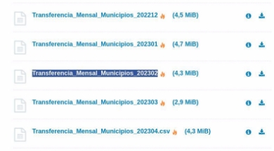
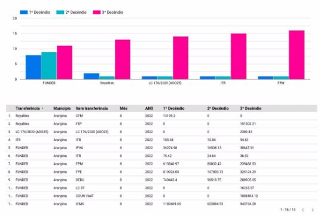

# Webscrapping csv files from a website

## Get the csv file and save on directus collection.

### Features

- Check daily(perhaps using flow) if you have a new file
- Check if the file has changed size (as it may have been updated).
- Capture the csv files and save them in a table within directus
- Do not allow duplicate data import in directus.
- Be careful with UTF-8 "Acrelândia" characters to avoid losing accents.
- You must create the collection in directus in the way you want.

### Location of CSV files

- [https://www.tesourotransparente.gov.br/ckan/dataset/transferencias-constituci onais-para-municipios](https://www.tesourotransparente.gov.br/ckan/dataset/transferencias-constitucionais-para-municipios)
- Name of files to capture:

Transferencia_Mensal_Municipios_202302

Monthly Transfer Municipalities YEAR MONTH

- All files that follow this nomenclature must be saved in a collection in directus.
- All years, all months.

**It's not your job, it will be mine.**

I will transform your data saved in Directus into graphs.
